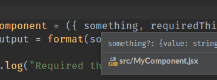
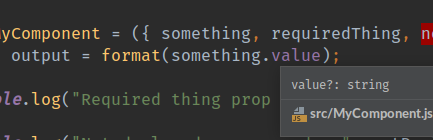

# React Prop Null Pointer Example

This repo demonstrates that `eslint` misses flagging potential null pointer exceptions which can occur in components declaring objects/shapes which are not required or with params which are not required.

It should be possible to infer potential null items and flag on usage that these must be either optionally chained or checked for validity before use.

## Usage

```
npm i
npm run verify
```

This will show the following errors to indicate that the checker is working:

```
 8:50  error  'notDeclared' is missing in props validation  react/prop-types
  8:63  error  'notUsed' is defined but never used           no-unused-vars
```

However it will _not_ flag the usage of a property of a potentially null object, or the usage of a potentially null property in a method.

```
npm run webpack
```

Now open one of the `*.html` files in a browser. Two examples will fail with JS errors, one will work. These indicate different possible runtime conditions of the component which are currently only caught at runtime but which could feasibly be caught by examining the code structure.

### Observations around PhpStorm/WebStorm

PhpStorm does go some lengths towards noticing the issue here:



In the function type declaration it spots that `something` is nullable as well as inferring the type of `value`. However it doesn't flag a null pointer, where it feels it could.



It has also marked `value` as `value?:string` hence spotting it can be null but again doesn't flag that passing this into a method that carries out an object operation on null will fail.

### Undeclared required prop

As an additional item noticed during the writing of this test repo, `MyComponent` declares `requiredProp` as a required Prop, but even in `src/works.js` which otherwise compiles, the prop isn't highlighted.

It's worth noting that in this case PhpStorm does actually highlight it, via it's HTML `RequiredAttribute` rule. This is useful and shows that it is possible to statically analyse this, but it's missing from eslint too.
